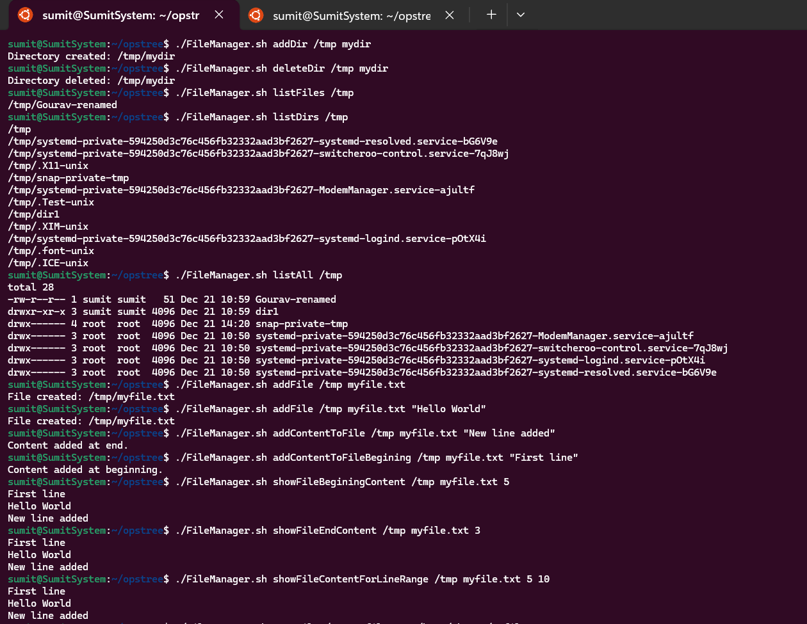
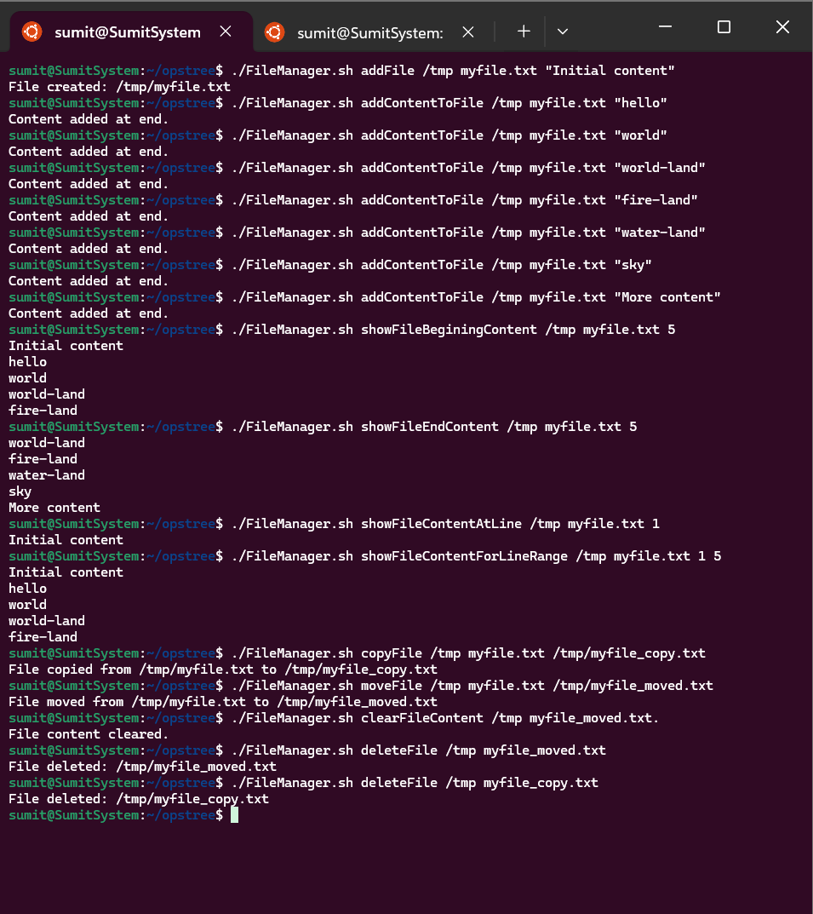

# Linux Assignment 01.2 – File & Directory Management Bash Script

This Bash script provides a simple command-line interface to manage **files and directories**.
You can create, delete, list, move, copy files/directories, and also **read or modify file content** from specific lines.

---

## Features

### Directory Operations

* Create a directory
* Delete a directory
* List files in a directory
* List directories
* List all contents

### File Operations

* Create a file (with or without content)
* Append content to a file
* Add content at the beginning of a file
* Show file content:

  * Beginning lines
  * Ending lines
  * Specific line number
  * Line range
* Move a file
* Copy a file
* Clear file content
* Delete a file

---

## Prerequisites

* Linux / macOS
* Bash shell
* Basic file system permissions

---

## Script Usage

```bash
./FileManager.sh <action> <path> <name> [arg4] [arg5]
```

### Arguments Explanation

| Argument | Description                                             |
| -------- | ------------------------------------------------------- |
| `action` | Operation to perform                                    |
| `path`   | Directory path                                          |
| `name`   | File or directory name                                  |
| `arg4`   | Optional (content, line number, destination path, etc.) |
| `arg5`   | Optional (used for line range)                          |

---

## Supported Actions & Examples

### Directory Commands

#### Create Directory

```bash
./FileManager.sh addDir /home/ubuntu testDir
```

#### Delete Directory

```bash
./FileManager.sh deleteDir /home/ubuntu testDir
```

#### List Files

```bash
./FileManager.sh listFiles /home/ubuntu
```

#### List Directories

```bash
./FileManager.sh listDirs /home/ubuntu
```

#### List All

```bash
./FileManager.sh listAll /home/ubuntu
```

---

### File Commands

#### Create File (Empty)

```bash
./FileManager.sh addFile /home/ubuntu test.txt
```

#### Create File With Content

```bash
./FileManager.sh addFile /home/ubuntu test.txt "Hello World"
```

#### Append Content to File

```bash
./FileManager.sh addContentToFile /home/ubuntu test.txt "New Line"
```

#### Add Content at Beginning

```bash
./FileManager.sh addContentToFileBegining /home/ubuntu test.txt "First Line"
```

---

### Read File Content

#### Show First N Lines

```bash
./FileManager.sh showFileBeginingContent /home/ubuntu test.txt 5
```

#### Show Last N Lines

```bash
./FileManager.sh showFileEndContent /home/ubuntu test.txt 5
```

#### Show Specific Line

```bash
./FileManager.sh showFileContentAtLine /home/ubuntu test.txt 10
```

#### Show Line Range

```bash
./FileManager.sh showFileContentForLineRange /home/ubuntu test.txt 5 10
```


---

###  File Move & Copy

#### Move File

```bash
./FileManager.sh moveFile /home/ubuntu test.txt /tmp/test.txt
```

#### Copy File

```bash
./FileManager.sh copyFile /home/ubuntu test.txt /tmp/test.txt
```

---

###  Cleanup Operations

#### Clear File Content

```bash
./FileManager.sh clearFileContent /home/ubuntu test.txt
```

#### Delete File

```bash
./FileManager.sh deleteFile /home/ubuntu test.txt
```


---

## Notes

* Ensure the script has execute permission:

```bash
chmod +x FileManager.sh
```

* Paths must exist before performing file operations.
* Use quotes when passing content with spaces.

---

## Author

**Gourav Sharma**
DevOps Learner | Linux | AWS | Bash |

---

