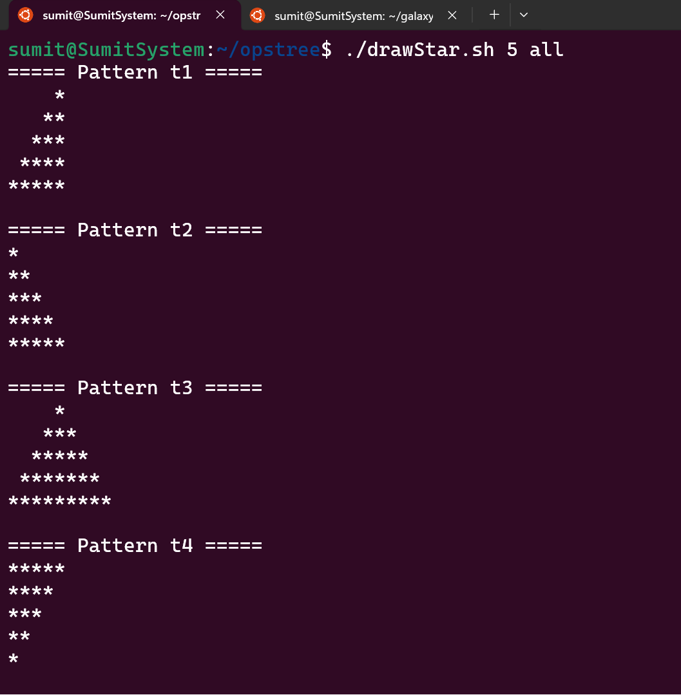
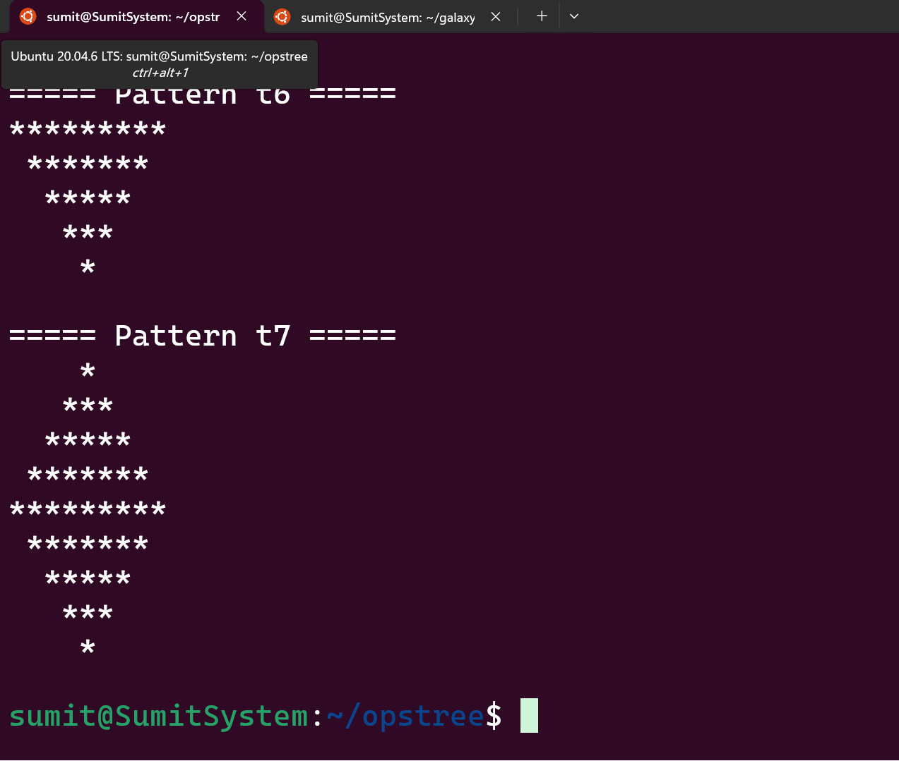
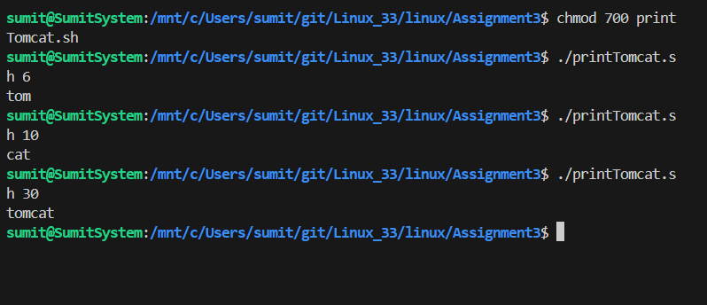

# # Linux Assignment 3 –Shell Scripting Assignment – Star Patterns & Tomcat Logic

1. **`drawStar.sh`** – Generates different star patterns
2. **`printTomcat.sh`** – Prints output based on number divisibility rules


---

## Files in This Repository

```text
.
├── drawStar.sh
├── printTomcat.sh
├── screenshots/
│   ├── star-all.png
│   ├── star-t3.png
│   └── tomcat.png
└── README.md
```

---

## Prerequisites

* Linux / macOS / WSL
* Bash shell
* Basic command-line knowledge

---

## Getting Started

### Make scripts executable

```bash
chmod +x drawStar.sh printTomcat.sh
```

---

#  Part A – `drawStar.sh`

###  Description

This script prints **star (`*`) patterns** based on:

* **Size** (number of rows)
* **Type** (`t1` to `t7`, or `all`)

It uses **simple loops and functions** to print spaces and stars.

---

## ▶ Usage

```bash
./drawStar.sh <size> <type|all>
```

### Examples

```bash
./drawStar.sh 5 t3
./drawStar.sh 5 all
```

---

##  Supported Pattern Types

| Type  | Description                                |
| ----- | ------------------------------------------ |
| `t1`  | Right-aligned increasing triangle          |
| `t2`  | Left-aligned increasing triangle           |
| `t3`  | Pyramid                                    |
| `t4`  | Left-aligned decreasing triangle           |
| `t5`  | Right-aligned decreasing triangle          |
| `t6`  | Inverted pyramid                           |
| `t7`  | Diamond pattern                            |
| `all` | Prints **all patterns (t1–t7)** in one run |

---

##  Example Output (`./drawStar.sh 5 all`)

```
===== Pattern t1 =====
    *
   **
  ***
 ****
*****

===== Pattern t2 =====
*
**
***
****
*****

===== Pattern t3 =====
    *
   ***
  *****
 *******
*********
```

(continues for all patterns…)


##  Screenshots (Star Patterns)

Add screenshots in a folder named `screenshots`.

## Screenshots – Star Patterns

### All Patterns



### Pyramid Pattern (t3)



#  Part B – `printTomcat.sh`

### Description

This script takes a **number** and prints output based on divisibility rules:

| Condition       | Output   |
| --------------- | -------- |
| Divisible by 3  | `tom`    |
| Divisible by 5  | `cat`    |
| Divisible by 15 | `tomcat` |

---

## ▶ Usage

```bash
./printTomcat.sh <number>
```

### Examples

```bash
./printTomcat.sh 6
# tom

./printTomcat.sh 10
# cat

./printTomcat.sh 30
# tomcat
```

If the number does not match any condition, **no output** is printed.

---

##  Screenshots – Tomcat Script




## Notes

* Scripts use **basic `for` loops**
* No advanced commands like `awk`, `sed`, or `printf`

---

## Author

**Gourav Sharma**
DevOps Learner |Bash | Aws
---
