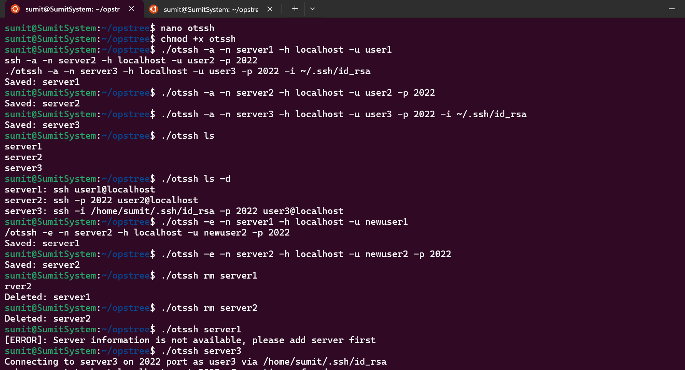

### 1️ `otssh` Utility Script

### 2️ Make Script Executable

chmod +x otssh

### 3️ Commands Example (All at Once)

```bash
# Add connections
./otssh -a -n server1 -h 192.168.21.30 -u kirti
./otssh -a -n server2 -h 192.168.42.34 -u kirti -p 2022
./otssh -a -n server3 -h 192.168.46.34 -u ubuntu -p 2022 -i ~/.ssh/server3.pem

# List connections
./otssh ls
./otssh ls -d

# Update connections
./otssh -u -n server1 -h server1 -u user1
./otssh -u -n server2 -h server2 -u user2 -p 2022

# List after update
./otssh ls -d

# Delete connections
./otssh rm server1
./otssh rm server2

# List after delete
./otssh ls -d

# Connect to server
./otssh server3
```

---

### 4️⃣ `README.md` Template

````markdown
# OTSSH Utility

`otssh` is a simple utility to manage SSH connections easily from the command line.

## Features
- Add SSH connections
- List SSH connections
- Update SSH connections
- Delete SSH connections
- Connect to a server

## Installation
1. Download the `otssh` script.
2. Make it executable:

```bash
chmod +x otssh
````

3. Move it to a directory in your PATH for global access (optional):

```bash
sudo mv otssh /usr/local/bin/
```

## Usage

### Add Connection

```bash
./otssh -a -n server1 -h 192.168.21.30 -u kirti
./otssh -a -n server2 -h 192.168.42.34 -u kirti -p 2022
./otssh -a -n server3 -h 192.168.46.34 -u ubuntu -p 2022 -i ~/.ssh/server3.pem
```

### List Connections

```bash
./otssh ls
./otssh ls -d
```

### Update Connection

```bash
./otssh -u -n server1 -h server1 -u user1
./otssh -u -n server2 -h server2 -u user2 -p 2022
```

### Delete Connection

```bash
./otssh rm server1
./otssh rm server2
```

### Connect to Server

```bash
./otssh server3
```

## Screenshots




