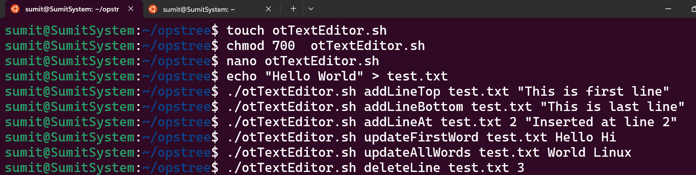
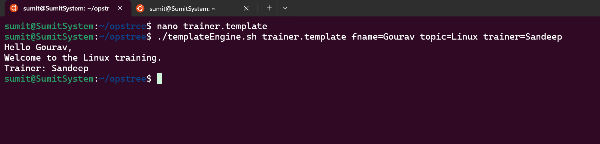

#  Linux Assignment 05 –Shell Scripting Assignment – Template Engine & Text Editor Utility


1. **Template Engine** – Generates text from a template file by replacing variables.
2. **Text Editor Utility** – Simple file manipulation like adding, updating, inserting, or deleting lines and words.


---

##  Files in this Repository

```text
.
├── templateEngine.sh      # Part A – Template Engine
├── otTextEditor.sh        # Part B – Text Editor Utility
├── template/              # Folder for template files
│   └── trainer.template
├── testfiles/             # Folder for test text files
│   └── example.txt
├── screenshots/           # Folder to store output screenshots
└── README.md
```

---

#  Part A – Template Engine (`templateEngine.sh`)

### Description

* Reads a **template file**.
* Replaces placeholders like `{{key}}` with values provided as `key=value`.
* Prints the final content to the terminal.

---

### Example Template (`trainer.template`)

```text
{{fname}} is trainer of {{topic}}
```

---

### Usage

```bash
chmod +x templateEngine.sh
./templateEngine.sh template/trainer.template fname=Sandeep topic=Linux
```

**Output:**

```text
Sandeep is trainer of Linux
```

---

### Script: `templateEngine.sh`

```bash
#!/bin/bash

template_file=$1
content=$(cat "$template_file")

shift

for pair in "$@"; do
    key=${pair%%=*}
    value=${pair#*=}
    content=$(echo "$content" | sed "s/{{${key}}}/${value}/g")
done

echo "$content"
```

---

#  Part B – Text Editor Utility (`otTextEditor.sh`)

### Description

* Add a line at top/bottom/specific line number
* Replace first word or all occurrences
* Insert a word after another word
* Delete a line or delete a line containing a specific word

---

### Usage

```bash
chmod +x otTextEditor.sh
```


### Script: `otTextEditor.sh`

```bash
#!/bin/bash

action=$1
file=$2

case "$action" in

addLineTop)
    sed -i "1i $3" "$file"
    ;;

addLineBottom)
    echo "$3" >> "$file"
    ;;

addLineAt)
    sed -i "${3}i $4" "$file"
    ;;

updateFirstWord)
    sed -i "0,/$3/s//$4/" "$file"
    ;;

updateAllWords)
    sed -i "s/$3/$4/g" "$file"
    ;;

insertWord)
    sed -i "s/$3/$3 $4/" "$file"
    ;;

deleteLine)
    sed -i "${3}d" "$file"
    ;;

deleteLineWithWord)
    sed -i "/$3/d" "$file"
    ;;

*)
    echo "Invalid command"
    ;;
esac
```

---


## Screenshots

### Text Editor Output



---



# Notes

* Uses only **basic Bash commands** (`echo`, `sed`, `cat`, `shift`)
* Easy to understand and modify
* Works on Linux, macOS, and WSL

---

## Author

**Gourav Sharma**
DevOps Learner |Bash | Aws
---
