I’ve created a **complete `README.md`** for **Assignment-7** 

---

##  What the README includes

* Assignment objective
* Prerequisites
* Project setup
* **All mandatory commands** (`-a`, `-i`, `-s`, `-t`, `-d`)
* Static analysis (checkstyle, findbugs, pmd)
* Unit testing + code coverage
* Tomcat deployment
* Optional tasks
* **Clear sections to attach screenshots**
* Step-by-step guide on **how to attach screenshots in README.md**

---

##  How YOU attach screenshots (IMPORTANT)

### 1️ Create screenshots folder

mkdir screenshots
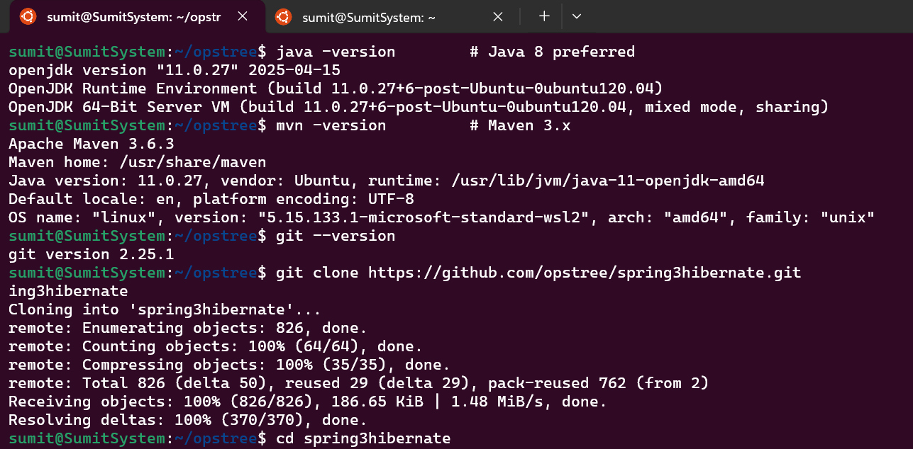

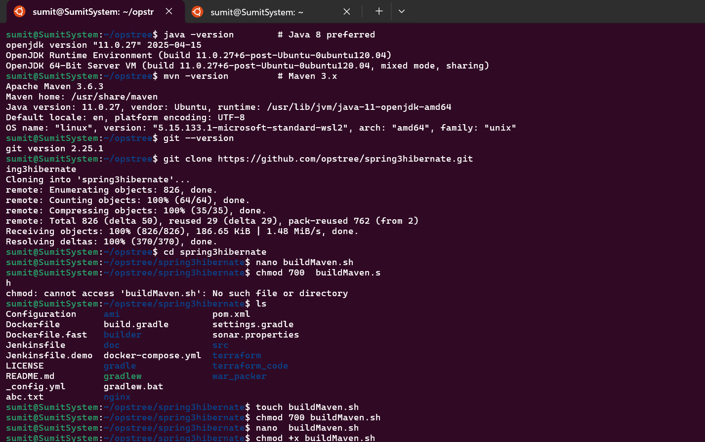

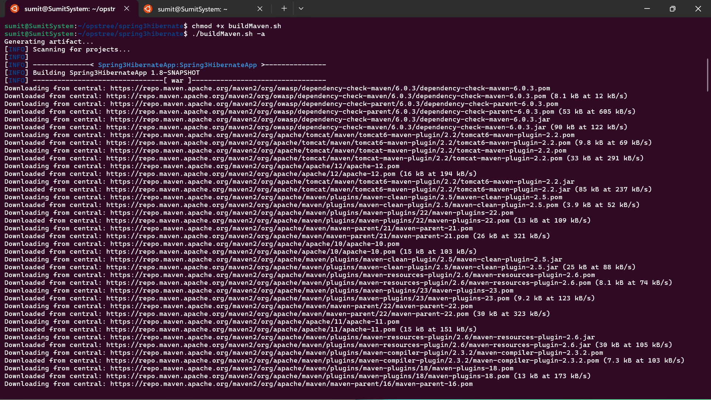

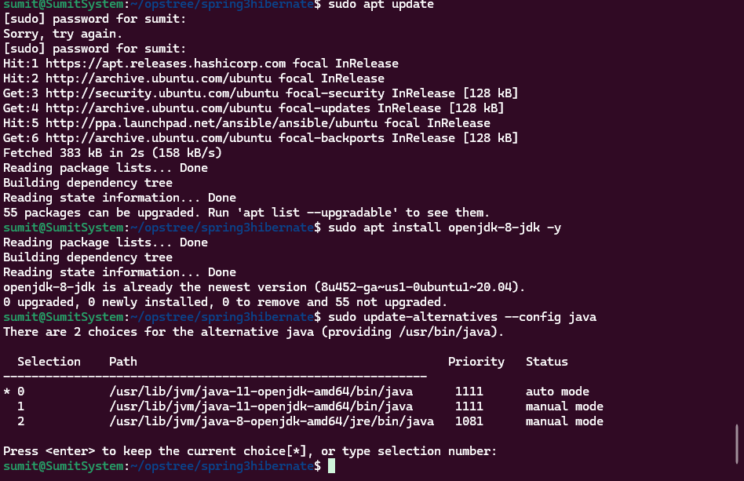

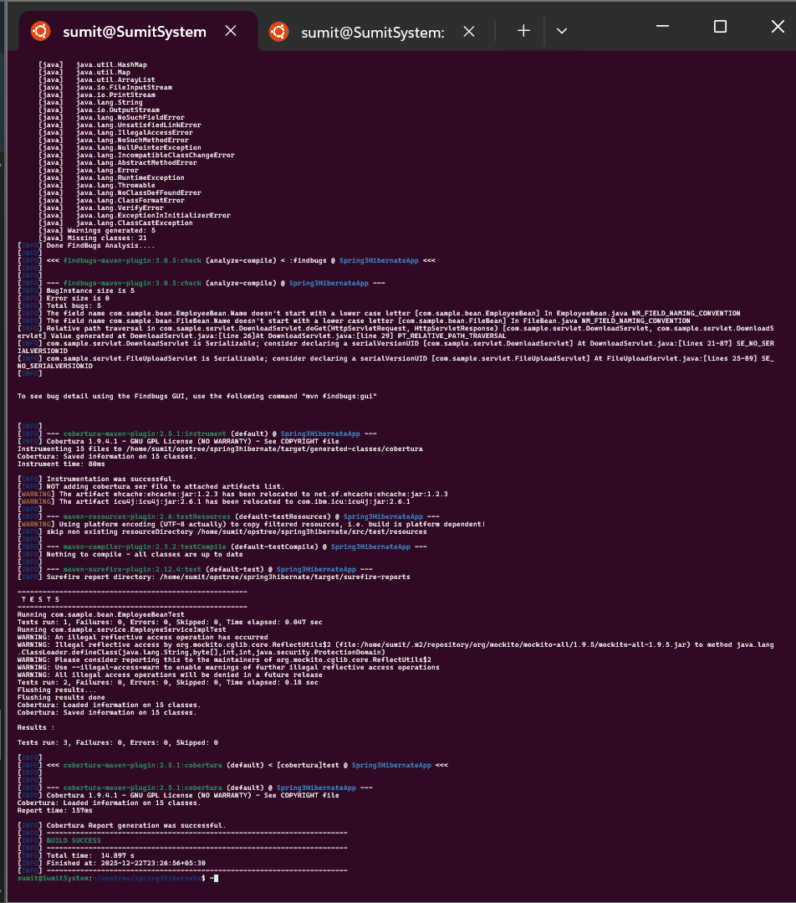

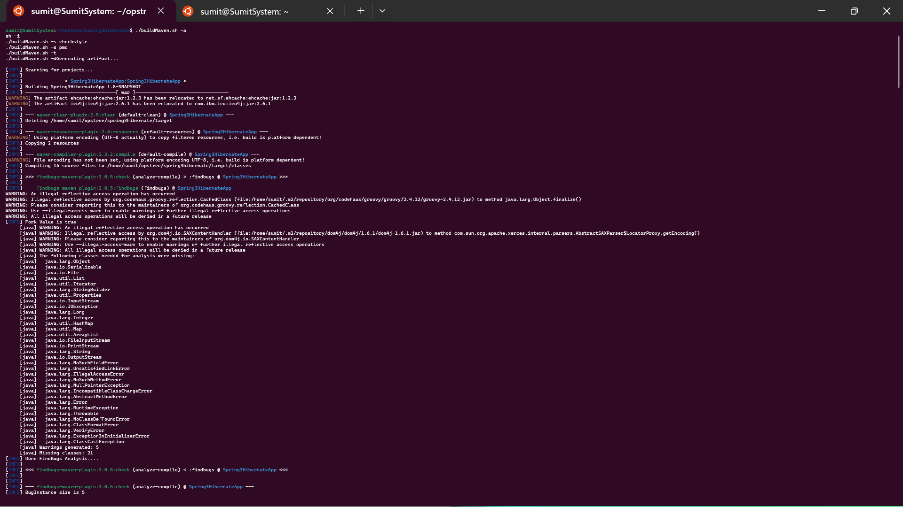

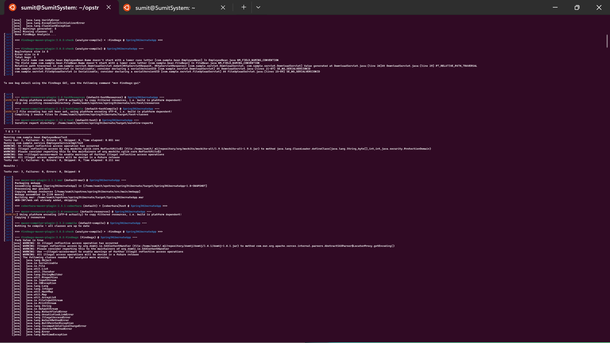

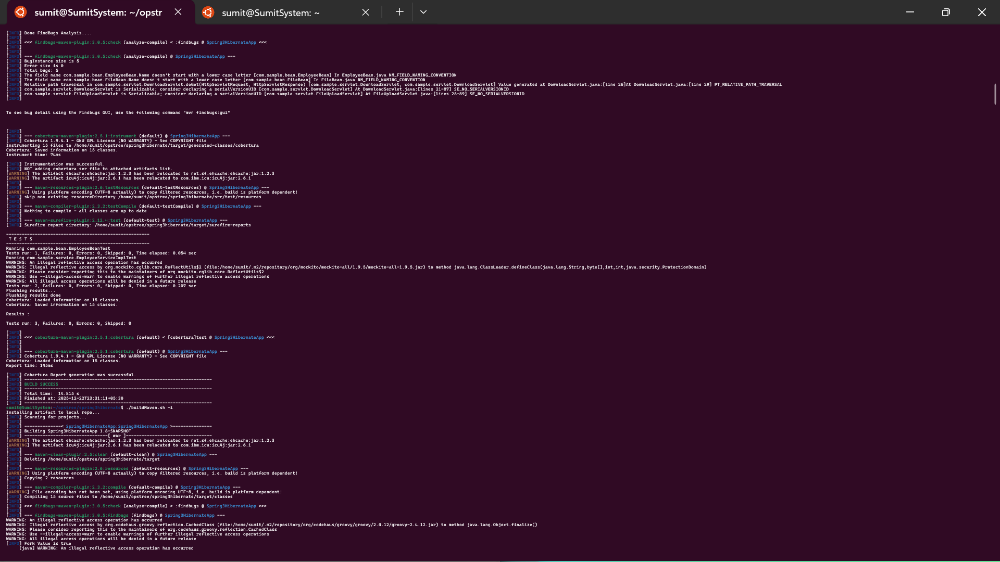

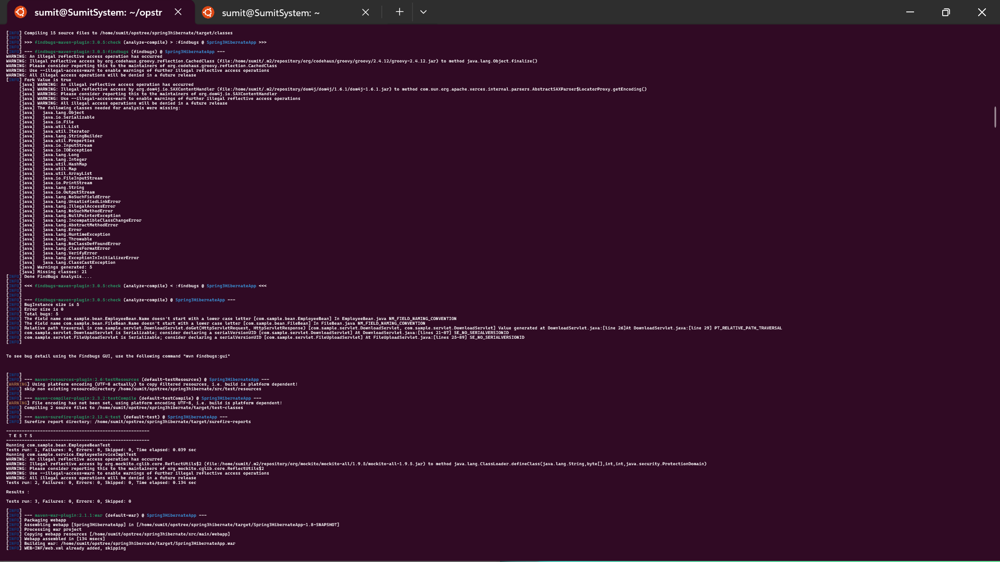

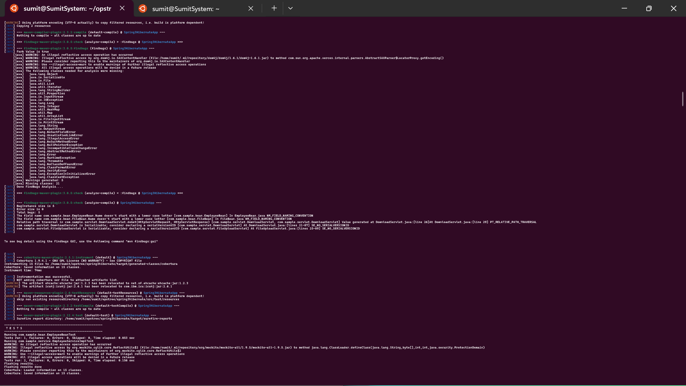

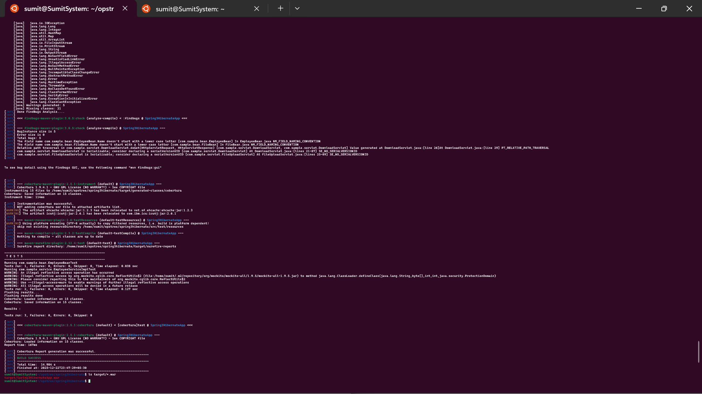

### 2️  Put screenshots inside

Example:

```text
screenshots/
├── build-success.png
├── checkstyle-report.png
├── pmd-report.png
├── coverage-report.png
├── tomcat-deploy.png
```

-------